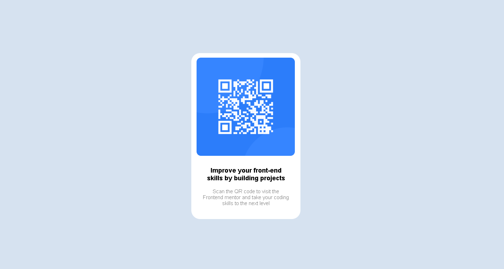

# Frontend Mentor - QR code component solution

This is a solution to the [QR code component challenge on Frontend Mentor](https://www.frontendmentor.io/challenges/qr-code-component-iux_sIO_H). Frontend Mentor challenges help you improve your coding skills by building realistic projects. 

## Table of contents

- [Overview](#overview)
  - [Screenshot](#screenshot)
  - [Links](#links)
- [My process](#my-process)
  - [Built with](#built-with)
  - [What I learned](#what-i-learned)
  - [Continued development](#continued-development)
  

**Note: Delete this note and update the table of contents based on what sections you keep.**

## Overview

### Screenshot




### Links

- Solution URL: [http://127.0.0.1:5500/html%20css%20project/QR.html]
- Live Site URL: [http://127.0.0.1:5500/html%20css%20project/QR.html]

## My process

### Built with

- Semantic HTML5 markup
- CSS custom properties
- Flexbox
- CSS box model
- CSS Grid

### What I learned

I have learned to use CSS box model and positions in CSS and also how can i adjust things over other.

To see how you can add code snippets, see below:
 <div class="text">
        <p class="text1">Improve your front-end skills by building projects</p>
        <p class="text2">Scan the QR code to visit the Frontend mentor and take your coding skills to the next level</p>
    </div>
```html

```
```css
  .qr{
    width: 225px;
    height: 225px;
    position: relative;
    top: 10px;
    left: 12px;
    border-radius: 10px;
  }
```

### Continued development

positions,flex,float.

